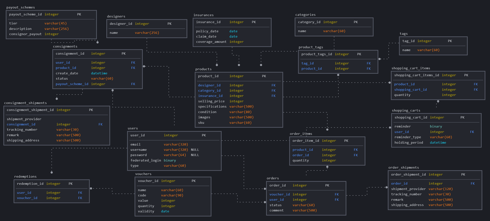

# Luxury Preowned Platform

## Demo

A live website of the application can be found here:

| Application | Link to Demo Website | Setup Instructions | Deployment Instructions |
| --- | --- | :---: | :---: |
| <b>Frontend</b>  (React framework) | https://reverent-pasteur-680936.netlify.app | [instructions](docs/DEVELOPMENT.md) | [instructions](docs/DEPLOYMENT.md) |
| <b>Admin</b>  (node.js/Express, HBS) | https://annette-p-luxury-preowned-adm.herokuapp.com | [instructions](https://github.com/annette-p/ecommerce-store-luxury-preowned-admin/blob/main/docs/DEVELOPMENT.md) | [instructions](https://github.com/annette-p/ecommerce-store-luxury-preowned-admin/blob/main/docs/DEPLOYMENT.md) |
| <b>Backend</b>  (node.js/Express, MySQL, Postgresql) | https://annette-p-luxury-preowned-api.herokuapp.com | [instructions](https://github.com/annette-p/ecommerce-store-luxury-preowned-backend/blob/main/docs/DEVELOPMENT.md) | [instructions](https://github.com/annette-p/ecommerce-store-luxury-preowned-backend/blob/main/docs/DEPLOYMENT.md) |

## Full Report for Project

Click [here](docs/project-report-luxury-preowned.pdf) for the full report of this project.

## Luxury Resale Market Analysis

Click [here](docs/luxury-resales-market-analysis-report.pdf) to view the report.

## Executive Summary

### Company and Product summary

Luxury Pre-owned is a resale luxury eCommerce stores that sell top edged consumer products and allow consignment of luxury consumer products through platform, promote sustainable luxury through circular fashion (shop, sell and repeat) and help reduce waste in fashion industry.

### Company and User Goal

|   |Key stakeholders|Goals|
|---|---|---|
|<b>Company</b>|Owner|<ul><li>Operate eCommerce store, consign-sell luxury products, made most process happen online and automated as much as possible. </li><li>Promote circular fashion through shop, sell, repeat. </li><li>Provide channels for consumer to purchase trusted, reliable source of authentic luxury products. </li><li>Provide channels to accommodate seller who want to sell their luxury products. </li><li>Channels to gather feedback data and collect user transaction data for future business expansion.</li></ul>|
|<b>Company</b>|Admin|<ul><li>To management and perform order processing </li><li>To manage product listing and recording.</li></ul>|
|<b>Customers</b>|Buyer|<ul><li>To buy authentic resale luxury products online at convenience. </li><li>Needed trusted and reliable since there are many counterfeit products out there. To reduce a risk of buying unauthentic items. </li><li>Need transparency and reasonable price as per market trend. </li><li>Purchase a rare, limited edition and vintage items that hard to come by and easily available in the market.</li></ul>|
|<b>Customers</b>|Seller (consignment)|<ul><li>Looking for trusted site/brand to sell or consign their authentic luxury products. </li><li>Want to finance new luxury purchases and empty the wardrobe. </li><li>To get rid of items that are no longer in trendy anymore</li></ul>|

### Product Goal

Provide secured platform for consumer to purchase and sell their authentic luxury consumer products, made the process transparent and visible to them. Ability to view their order transactions, history and as well as manage their account.

### Business Logic

Refer to [attached PDF file](docs/business-logic.pdf) for details on the business logic.

### Product & Features

|Features|Benefits to Users|Benefits to Company|
|---|---|---|
|**Listing** / **Product Details** / **Shopping Cart**|<h4>Listing</h4><ul><li>List of all products on the first page of the site application <ul><li>Display the image with function to hover image changes, provide quick views and idea how it looks like when using the products <li>Name if the brand or designer display o Details of the products <li>Price <li>Estimate retail price</ul></li> <li>Ability to click on any area of the product to view more details about that respective product </li><li>Login is not required makes it easy for customers who just new to the page and has yet to have account to explore the product and the site around</li></ul> <h4>Product Details</h4><ul><li>Details of the products </li><li>Ability to add to cart and to perform quick checkout to complete the payment </li><li>Collapse and expandable of the product information such as description, specification, condition and etc </li><li>Option to sell the same product if customer who are viewing the page is having the similar products. </li><li>Indication of the product being authenticated and the return/refund are allowed. </li><li>Login is not required makes it easy for customers who just new to the page and has yet to have account to explore the product and the site around.</li></ul> <h4>Shopping Cart</h4><ul><li>Accumulated the items that intended to purchase </li><li>It provides the quick summary details of the product (brand/designer name, product type, price, condition, quantity) </li><li>Ability to add more quantity or reduce and remove the item from shopping cart.</li></ul>|<ul><li>Provide a complete features of eCommerce store to display products, with its details to allow customer to make to purchase decision, shopping cart and secured payment process via the platform. The sales transactions can happen without human interaction and customer self-service. </li><li>Indication and assuring of product authenticity being authenticated by the company, giving the customer peace of mind that they are buying an authentic product. Answer their pain point of buying authentic products online. </li><li>Ability to attract any customers who are viewing the products and are having the same product to consign their product through the platform. </li><li>UX/UI design in such a way that within 3 click, customers are able to complete the checkout and payment process. With this allow sales to happen quicker than needed to navigate more click to complete the transactions. </li><li>No login required for listing page, product page, and even add to cart. This allows customers who just want to browse around or new to the site to view the products and add some of them into shopping cart to comeback later for actual purchase. It helps increase UX and user stickiness which will lead to account creation later when customers want to actually purchase it.</li></ul>|
|**Consignment Page**|<ul><li>Provide information of how to consign the product with the platform </li><li>Consignment rates are provided in the collapse table, easy to navigation and collapse when no longer needed. </li><li>Easy steps to consign with the platform and that’s being summaries in carousel of the page. </li><li>Product consignment form or request for appointment to check products to consign are available on the page, with easily collapse or expand as wish.</li></ul>|<ul><li>Make consignment easy for customer who wish to sell their products online and ensure that their luxury items are being taken care of. </li><li>The more consignment received via platform, the more product listing the company will have. </li><li>More consignment means more business transactions to the company from consignment rate </li><li>More listing means more sales to company which return increasing in revenue.</li></ul>|
|**Search and filtering** /  **Filtering section for limited edition items, vintage items and others**|<ul><li>Ability to perform search on the product listing by any key words. The system will match those key words to existing products in database across all categories, designers and brand </li><li>Quick filtering by selecting the pre-defined filtering provided by platform (e.g. by categories, by designer, new arrival, limited edition, vintage). </li><li>Make filtering or search to desired information with specific product easier for customers.</li></ul>|<ul><li>Provide better UX/UI of the products. </li><li>With easy navigation, quick to filter to get the specific information, makes decision easier for customers and in return, in crease sales transaction to company</li></ul>|
|**Feedback Form**|<ul><li>Customers can send feedback to the site owner on whatever suggestion or new request they might have or wish to improve the usability.</li></ul>|<ul><li>Ability to collect more data through feedback and suggestion (this includes the data of customers deciding to delete the account) for any future improvement to any features or new business idea.</li></ul>|
|**Account and Order Management**|<ul><li>Users who have transactions and account with the site, can view their profile via platform <li>Allow customers to self-manage their profile, help reduce the work to admin staff. </li><li>Ability to view orders (both purchase and sell) made they them, with different status, tracking their orders via platform. </li><li>Ability to manage their own profile (account update, change account details, change password)</li></ul>|<ul><li>Allow customers to self-manage their profile, help reduce the work to admin staff. </li><li>Customers can track their orders, view status of their orders (purchase, consignment) without send query to customers service of the site.</li></ul>|
|**Account and profile creation**|<ul><li>Super easy for account creation with the platform. Just name, username, email and set password then customers are up to make a purchase on the site.</li></ul>|<ul><li>Easy creation yet secured allow customers to have quick account setup to make a purchase transaction through platform.</li></ul>|
|**Deletion of the account and the listing**|<ul><li>Customers can delete their account anytime when they decided not to use the platform for any reason.</li></ul>|<ul><li>The account will be removed from the platform DB, no record of customer will be kept on the platform (old orders will be re-assigned to fake users account for business audit trail purpose) </li><li>The data provided for the reason to leave the platform will be collected and stored separately for future revision.</li></ul>|

See [attached document](docs/testing-manual-project3.pdf) for more details on each product features.

## UX/UI

### Strategy

#### Users

|Consumer Demographic|Characteristic behavioural|
|---|---|
|**Gen Z / Millennials**|<ul><li>High interest in collaboration pieces, <li>consider resale value when purchasing, <li>influence by sustainability (in trend but not practically into it), <li>high on social media interaction, <li>shift spending from traditional luxury to premium luxury</ul>|
|**Gen X**|<ul><li>Interest in traditional luxury</ul>|
|**True-luxury consumers**|Status seeker, fashionista, Rich up-starter, absolute luxurer, social wearer (majority are millennial tribe) <ul><li>Seeking extravagance <li>Runway collections <li>New creativity ((new wave luxury value) <li>Very high interest in limited edition and rate items<ul>|

|Users||
|---|---|
|**Customer (buy)**|
Customers (Gen Z, millennials, Gen X, true-luxury consumers) who buy the authentic luxury products on the platform

individual customers who are looking to buy trusted, authentic resale luxury products online, who need assuring and guarantee the authenticity of the products their purchased.
|
|**Customer (consign)**|
Customers (Gen Z, millennials, Gen X, true-luxury consumers) who are looking to sell their authentic luxury products on the platform

Individual customers who are looking for trusted site to sell their authentic items online with less effort, has transparency to trace the status and what’s going on with their consignment.
|
|**Admin of the site**|The admin (staff) of the site to perform administrative tasks related to orders and consignment managements, product management. |

### User needs and pain points

||Needs|Pain Points|
|---|---|---|
|**Customer (buy)**|<ul><li>Looking for vintage, limited edition, rare items that are not easily available on retail.<li>Looking to purchase on trusted, reliable source of authentic luxury products <li>Need affordable authentic luxury items <li>Transparency on the price, authenticity with guarantee <li>Need federated login ties to their social media account as they are super high on social media interaction</ul>|<ul><li>Rare items, limited edition or vintage pieces are hard to come by<li>Unsure of the authenticity of the product purchase (be it online of in store) unless purchase directly from the actual brand store which is the first- hand item. <li>Need to manage several login accounts for different website instead of just using their social media to login as user authentication|
|**Customer (sell)**|<ul><li>To sell their authentic luxury items with no effort (to either their wardrobe, financing new luxury items of desired, to recycle or change a new in trend luxury item)<li>Need to sell on legitimated and trusted site.<li>Transparent process, can track the status an know what’s going on with the process.<li>Need federated login ties to their social media account as they are super high on social media interaction<ul>|<ul><li>The selling process are too complicated and no transparency <li>Afraid of being switch from the authentic products to counterfeit from the store (untrusted site) <li>Need to manage several login accounts for different website instead of just using their social media to login as user authentication </ul>|
|**Admin (staff)**|<ul><li>To manage and perform order (purchase and consignment) processing as flowless as possible<li>To manage product and listing on the site</ul>|<ul><li>Need the order flow correctly with less complication or unnecessary step to perform their task or reducing efficiently in managing orders and products.</ul>|

## Structure

### Site Map

Refer to [PDF file](docs/site-map.pdf) for the site map. 

This site has achieved within 3 click checkout experience for user

### Wireframe

Refer to [PDF file](docs/wireframe.pdf) for the wireframe for the following:
* Home page 
* Landing page
* Listing page
* Product page
* Shopping cart page
* Profile page

### Surface Plane

#### Responsiveness

This website is responsive to small, medium and large screen sizes. It is a mobile first approach application. And it is single page application.

#### Colours

Refer to attached PDF files for more details.
* [deep-grey-gold.pdf](docs/deep-grey-gold.pdf)
* [grey-gold-orange.pdf](docs/grey-gold-orange.pdf)

**Combination of beige grey, deep grey and shade of gold:** use this theme combination for the site surface plane including the brand logo to represent mood and tone for the platform.

Gold represents luxury, extravagance, wealth, riches, and excess. Gold is a warm colour that can be either bright and cheerful or sober and traditional. It shares several of the same attributes of the yellow and brown which is associated with illumination, love, compassion, courage, passion, magic, and wisdom

While grey represents luxury, calm, neutrality and balance. Grey has a very soothing and cooling presence.

This is an eCommerce platform for luxury resales hence, the combination serves the purpose of platform mood and tone.

#### Typography

Using **google font**:
* Montserrat, sans-serif: for h1, h2, h3, h4, h5 and h6
* Open Sans, sans-serif: for a tag and p tag

**Montserrat** is widely used for products such as bags. It is simple geometric letters which make the design appealing and have a large X-height. It provides the vibes of trust and can go best with maximum fonts. The font has a charming tale, features friendly and open curves. This makes for a more natural reading rhythm more commonly found in humanist and serif types.

**Open Sans** is widely used in high end stores. It was designed with an upright stress, open forms, and a neutral, yet friendly appearance. It was optimized for print, web, and mobile interfaces, and has excellent legibility characteristics in its letterforms.

#### Layout

**Collapsible Tab** is used to make sure the site and other sections on the page can be viewed unobstructed across devices of all sizes and user can hide and show the search options as desired.

**Stackable column** is applied to smaller screen size for better UX and readability.

**Offcanvas** toggle from right side of the page is use for shopping cart to maintain same product page when user click on shopping cart to view cart details and perform check out. This is to improve UX of the product, shopping cart and checkout process.

**Popup modal** is used for login, account sign up and some other pop up information to provide users with info without leaving their current page. So, there will be no page change when user need to perform login or even quick account signup with conveniently just click on cross to close the modal pop up.

## Technologies Used

### Frontend

| Technology | Description |
|---|---|
| **HTML 5** | To structure the content of the website. |
| **CSS** | To add stylistic touches to the website. |
| **Bootstrap 5.1** | To structure the layout of the website (i.e., cards, modal, interactive container, column) and ensure website is mobile responsiveness.|
| **React Bootstrap v2.0.0 (Bootstrap 5.1)** | To use Navbar, collapse tools, collapse bar & tab, offcanvas that compatible with react framework. |
| **GoogleFonts** | To style the typography on the website to enhance the visual experience of users. |
| **FontAwesome** | Uses the icons provided by FontAwesome to enhance the user experience by making user interaction with the application more intuitive. |
| **React Framework** | To create component-based interactive UIs. |
| **Email JS** | To securely send email from Javascript. In this contact, mainly use to receive appointment request for product consignment, new service testing hypothesis, feedback from user submission through this eCommerce application. |

### Admin Site

| Technology | Description |
|---|---|
| **Node.js / Express framework** | Backend web application framework for Node.js to build web applications |
| **Express Handlebars (HBS)** | 
A templating engine to render web pages to the client side from data on the server-side, used with express as the hbs module. 

It ensures minimum templating and is a logicless engine that keeps the view and the code separated.
 |
| **Caolan form** | To create, parse and validate forms in node |
| **Cloudinary** | For end-to-end image- and video-management solution from image and video uploads, storage, manipulations, optimizations to delivery. |

### API & DB

| Technology | |
|---|---|
| **Node.js / Express framework** | Backend web application framework for Node.js to build web applications and APIs. To connect the react frontend to MySQL / PostgreSQL. |
| **MySQL / PostgreSQL**| Oen-source relational database management system |
| **ORM, database migrations, Bookshelf** | 
Bookshelf is a JavaScript ORM for Node. js, built on the Knex SQL query builder. It features both Promise-based and traditional callback interfaces, transaction support, eager/nested-eager relation loading, polymorphic associations, and support for one-to-one, one-to-many, and many-to-many relations.

It is a simple library for common tasks when querying databases in JavaScript, and forming relations between these objects, taking a lot of ideas from the Data Mapper Pattern.
|
| **Stripe payment** | Payment processing software and application programming interfaces for e- commerce websites and mobile applications, supporting the electronic transfer of money from a customer's bank (issuing bank) into a merchant's bank (acquiring bank) as payment for goods or services bought with a credit card. |

## Logical Schema

## Software Application Development

Here are some test cases of some features available on this application as to demonstration.

### User Story, Test Case and Acceptance Criteria

Refer to [PDF file](docs/test-case-acceptance-criteria.pdf).

### Testing

Refer to the [attach](docs/testing-manual-project3.pdf) for step-by-step instructions for the following:

* Listing
* Search and Filter
* Product details
* Shopping cart
* Checkout (stripe)
* Login
* Account registration
* Profile management
  * Dashboard
  * Purchase orders
  * Consignment orders 
  * Account setting
    * Editprofile
    * Change password
    * Delete account
* Consignment
  * Consignment form
  * Virtual appointment form
* Product authentication

## Known bugs

### Product inventory issue

* After order completion, inventory is not updated

### Shopping Cart

* Vertical scroll always appears even though the cart items are not occupied full div

## Future Development Features

### Login

* To implement registration confirmation via link sent to registered email address
* To implement user/password reset (authentication through URL sent to registered email
address)
* Implement federated login (Gmail, Facebook, Instagram, Tiktok).
* Implement option to "remember me" log in and option to allow user to login every time
accessing the page without remember me.

### Profile

* To implement change email under account management page
* Implement force re-login after changing password and trigger email notification informing password has been change

### Product

* Implement the alert message box when customer view the product that has quantity of 1, to courage them to make a purchase.

### Shopping cart

* Toimplementemailautomatedtoabandonshoppingcarttocourageandremindcustomers of their items in the cart to complete the order (to increase sales transaction to company)

### Consignment

* Implement photo upload (improve from existing version that using image URL) in React frontend.
* Implement new order creation in HBS side for admin processing after first appointment assessment made from virtual appointment

### Admin portal

* Implement search features in admin portal

### New Services

* Implement email JS integration for feedback form, new services such as instalment plan, VIP plan to gather and test hypothesis and market need. 
* Implement sharable post via social media 
* Chatbot

## References

* Device simulator application
  * http://www.responsinator.com/
* Colourschemesgenerator
  * https://coolors.co/
* Images are from:
  * https://www.gucci.com/us/en/
  * https://ap.louisvuitton.com/eng-sg/
  * https://www.balenciaga.com/en-sg
  * https://www.hermes.com/sg/en/
  * https://www.celine.com/en-gb/home
  * https://www.dior.com
  * https://www.dolcegabbana.com/
  * https://www.chanel.com/sg/
  * https://www.alexandermcqueen.com/
  * https://www.alexanderwang.com/
  * https://www.fendi.com/
  * http://asia.christianlouboutin.com/
  * https://www.miumiu.com/sg
  * https://www.phillips.com
  * https://www.prada.com/
  * https://www.rolex.com/
  * https://www.ysl.com/en-sg
  * https://www.valentino.com/
  * https://www.versace.com/
* VDO from:
  * https://www.fashionphile.com
  * https://www.aucshow.net/assets/frontend/global/img/Processing.gif